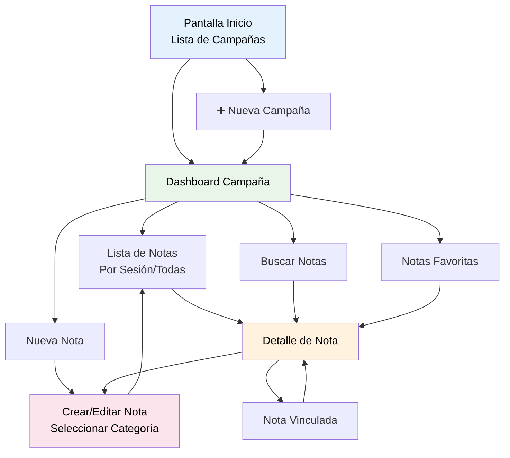

# DnD Notes Companion

Este aplicacion corresponde a una aplicacion destinada a asistir en tomar notas de una campaña de TTRPG. Permitira tomar notas y organizarlas según campaña y sesion. Dentro de cada campaña, se podrá ver la informacion según sesion o todas las sesiones hasta ahora. Se pueden tomar notas segun categorias, tales como: personajes, lugares, acontecimientos, objetos, misiones y combates, además de categorias personalizadas que puede crear el usuario.

## Caracteristicas
**Requerimiento funcional:**
- La aplicación debe permitir crear, editar y eliminar notas de cada categoria.
- La aplicación debe permitir buscar notas dentro de una campaña segun palabras claves o categoria.
- La aplicación debe permitir poner notas como favoritas para que estas aparezcan primero que otras.
- La aplicación debe permitir organizar las notas según campañas y según sesion, además de almacenar la fecha en la que fue creada y editada.
- La aplicación debe tener multiples categorias para las notas, estas serán: Personaje, Lugar, Acontecimiento, Mision, Objeto, y categorias personalizadas que el usuario puede crear y funcionen similar al resto de categorias.
- La aplicación mostrará en otro color cualquier palabra o frase que refiera a otra nota. Al darle click a esta se redigira a la nota correspondiente.

**Requerimiento no funcional:**
- La aplicación debe ser intuitiva para usuarios sin experiencia.
- La aplicación debe poder funcionar sin conexion a internet.

**Historia de usuario:**
- Como jugador de TTRPG quiero tomar notas de manera facil para distintas campañas de rol en las que estoy participando, además de poder dividirlas por sesiones para poder medir el progreso.

- Como jugador quiero que organizar notas sea facíl segun el tipo de nota que estoy tomando, y según la sesion en la que las tome.

## Pila de Tecnología

**Cliente:** Flutter, AndroidSDK

## Enlace a la presentacion

https://youtu.be/rzs11Rfsfao

