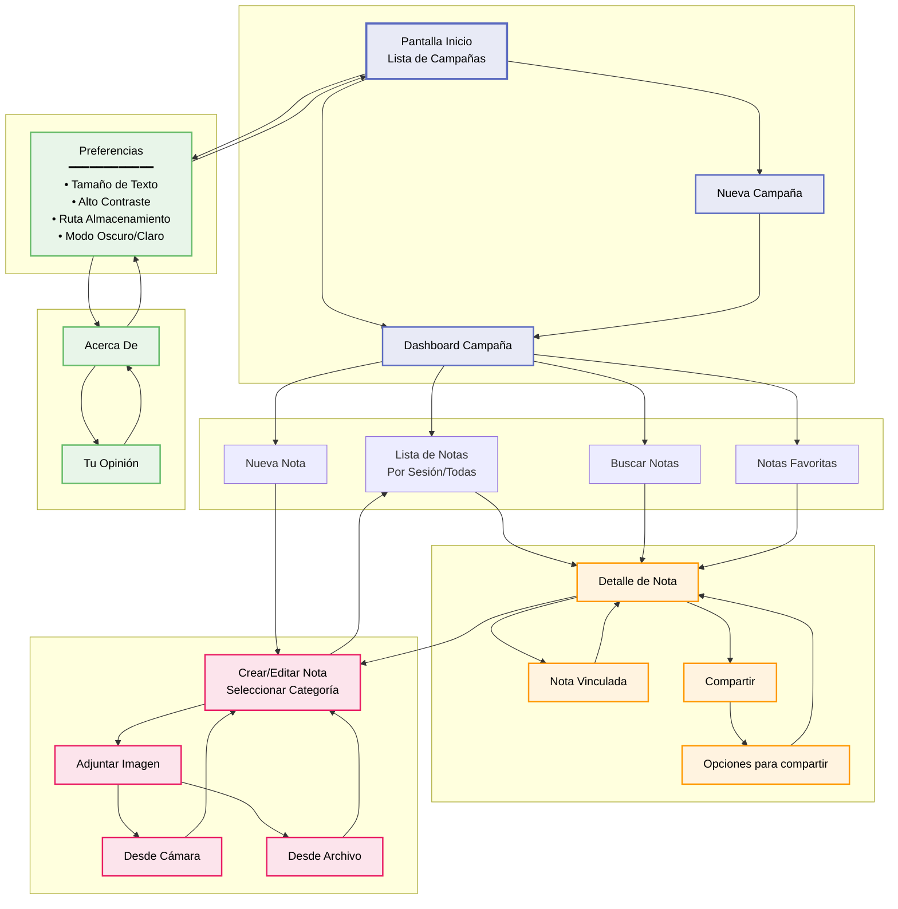

# DnD Notes Companion

DnD Notes Companion es una aplicación movil desarrollada en Flutter diseñada para asistir a los jugadores o directores de juego (DMs) de juegos TTRPGs (juegos de rol de mesa) para llevar registro de las sesiones y aspectos importantes de la historia de una campaña.
Esta permite crear, editar y eliminar notas, las cuales son organizadas a traves de campañas y categorias, incluso estando conectadas entre ellas para facilitar la navegacion entre las notas.

## Caracteristicas
**Requerimiento funcional:**
- La aplicación debe permitir crear, editar y eliminar notas de cada categoria.
- La aplicación debe permitir buscar notas dentro de una campaña segun palabras claves o categoria.
- La aplicación debe permitir poner notas como favoritas para que estas aparezcan primero que otras.
- La aplicación debe permitir organizar las notas según campañas y según sesion, además de almacenar la fecha en la que fue creada y editada.
- La aplicación debe tener multiples categorias para las notas, estas serán: Personaje, Lugar, Acontecimiento, Mision, Objeto, y categorias personalizadas que el usuario puede crear y funcionen similar al resto de categorias.
- La aplicación mostrará en otro color cualquier palabra o frase que refiera a otra nota. Al darle click a esta se redigira a la nota correspondiente.
Adjuntar imágenes desde galería o cámara directamente en las notas.
- La aplicación permite exportar las notas como PDF, para ser guardadas o compartidas
- La aplicacion cuenta con una pantalla de preferencias para personalizar el tema (claro u oscuro), orden de las notas (fecha o alfabeticamente), tamaño del texto global, configuración de busqueda (solo filtrar por titulo o incluir descripción).
- La aplicacion cuenta con una pantalla “Acerca de” con descripción del proyecto y sección de retroalimentación, donde el usuario puede responder preguntas cargadas desde un archivo JSON y enviar su opinión por correo electrónico.

**Requerimiento no funcional:**
- La aplicación debe ser intuitiva para usuarios sin experiencia.
- La aplicación debe poder funcionar sin conexion a internet, con almacenamiento local persistente gracias a sqflite.
- La aplicacion cuenta con compatibilidad visual con el sistema, tema oscuro o claro.

**Historia de usuario:**
- Como jugador de TTRPG quiero tomar notas de manera facil para distintas campañas de rol en las que estoy participando, además de poder dividirlas por sesiones para poder medir el progreso.

- Como jugador quiero que organizar notas sea facíl segun el tipo de nota que estoy tomando, y según la sesion en la que las tome.

## Pila de Tecnología

**Cliente:** Flutter, AndroidSDK, image_picker, printing + pdf, provider, google_fonts

## Enlace a la presentacion
ACTUALIZAR ENLACE

## Diagrama

```mermaid
graph TB
    subgraph Principal[" "]
        A[Pantalla Inicio<br/>Lista de Campañas]
        B[Nueva Campaña]
        C[Dashboard Campaña]
    end
    
    subgraph Notas[" "]
        D[Lista de Notas<br/>Por Sesión/Todas]
        E[Buscar Notas]
        F[Notas Favoritas]
        G[Nueva Nota]
    end
    
    subgraph Detalle[" "]
        H[Detalle de Nota]
        J[Nota Vinculada]
        SHARE[Compartir]
        OPTS[Opciones para compartir]
    end
    
    subgraph Edicion[" "]
        I[Crear/Editar Nota<br/>Seleccionar Categoría]
        IMG[Adjuntar Imagen]
        CAM[Desde Cámara]
        FILE[Desde Archivo]
    end
    
    subgraph Config[" "]
        PREF["Preferencias<br/>━━━━━━━━━━━━<br/>• Tamaño de Texto<br/>• Alto Contraste<br/>• Ruta Almacenamiento<br/>• Modo Oscuro/Claro"]
    end
    
    subgraph Info[" "]
        ABOUT[Acerca De]
        RATE[Tu Opinión]
    end
    
    A --> B
    A --> C
    A --> PREF
    B --> C
    
    C --> D
    C --> E
    C --> F
    C --> G
    
    D --> H
    E --> H
    F --> H
    G --> I
    
    H --> I
    H --> J
    H --> SHARE
    J --> H
    SHARE --> OPTS
    OPTS --> H
    
    I --> IMG
    I --> D
    IMG --> CAM
    IMG --> FILE
    CAM --> I
    FILE --> I
    
    PREF --> ABOUT
    
    ABOUT --> RATE
    ABOUT --> PREF
    RATE --> ABOUT
    PREF --> A
    
    style A fill:#e8eaf6,stroke:#5c6bc0,stroke-width:3px,color:#000
    style C fill:#e8eaf6,stroke:#5c6bc0,stroke-width:2px,color:#000
    style B fill:#e8eaf6,stroke:#5c6bc0,stroke-width:2px,color:#000
    style H fill:#fff3e0,stroke:#ff9800,stroke-width:2px,color:#000
    style J fill:#fff3e0,stroke:#ff9800,stroke-width:2px,color:#000
    style SHARE fill:#fff3e0,stroke:#ff9800,stroke-width:2px,color:#000
    style OPTS fill:#fff3e0,stroke:#ff9800,stroke-width:2px,color:#000
    style I fill:#fce4ec,stroke:#e91e63,stroke-width:2px,color:#000
    style IMG fill:#fce4ec,stroke:#e91e63,stroke-width:2px,color:#000
    style CAM fill:#fce4ec,stroke:#e91e63,stroke-width:2px,color:#000
    style FILE fill:#fce4ec,stroke:#e91e63,stroke-width:2px,color:#000
    style PREF fill:#e8f5e9,stroke:#66bb6a,stroke-width:2px,color:#000
    style ABOUT fill:#e8f5e9,stroke:#66bb6a,stroke-width:2px,color:#000
    style RATE fill:#e8f5e9,stroke:#66bb6a,stroke-width:2px,color:#000
```
## Capturas de Pantalla
IMPLEMENTAR SCREENSHOTS A TRAVES DE ASSETS LUEGO!